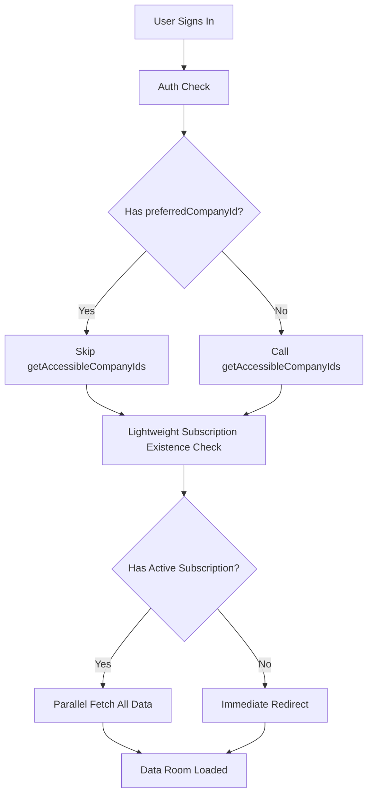

# Comprehensive Performance Optimization Plan

## Problem Analysis

Current performance issues:

- **20 seconds** to load data-room on sign-in
- **17 seconds** on reload/hot reload  
- **30 seconds** to redirect to owner-subscription-expired page

## Root Causes Identified

### 1. Expensive `getAccessibleCompanyIds` Called Unnecessarily

**Location**: `app/data-room/actions.ts:3427-3429`

**Problem**: Called EVERY time, even when `preferredCompanyId` is provided. This method:

- Calls `isSuperadmin` → `getRolesByUserId` (UNION query with JOIN)
- Calls `getRolesByUserId` again (UNION query)
- Calls `listOwnedByUser` (UNION query)
- Calls `getUserSubscriptionState` (complex UNION with JOIN)
- Then for EACH owned company, calls `getCompanySubscriptionState` (N queries!)

**Impact**: 5-15 seconds wasted when company ID is already known

### 2. Heavy Subscription State Queries

**Location**: `app/data-room/actions.ts:3455-3458`

**Problem**: "Ultra-fast" check still calls full `getCompanySubscriptionState` and `getUserSubscriptionState` which:

- Return full subscription objects with all details
- Execute complex UNION queries with JOINs
- We only need a boolean: does subscription exist?

**Impact**: 2-5 seconds for subscription check

### 3. Duplicate Work in `GetCompanyAccessSnapshot`

**Location**: `app/data-room/actions.ts:3507-3511`

**Problem**: Called AFTER ultra-fast check, duplicating:

- `isSuperadmin` check (already done in getAccessibleCompanyIds)
- `getById` (already done in ultra-fast check)
- Subscription checks (already done in ultra-fast check)

**Impact**: 1-3 seconds of duplicate queries

### 4. Performance-Log API Failure

**Location**: `app/api/performance-log/route.ts:19-26`

**Problem**: Tries to write to filesystem on Vercel (read-only), causing 500 errors

**Impact**: Errors in console, but doesn't affect performance

### 5. Sequential Operations

**Location**: `app/data-room/actions.ts:3421-3512`

**Problem**: Operations run sequentially when some could be parallel:

- Auth check → getAccessibleCompanyIds → ultra-fast check → full access check

**Impact**: Adds latency

## Solution Architecture




## Implementation Plan

### Phase 1: Skip Expensive `getAccessibleCompanyIds` When Possible

**File**: `app/data-room/actions.ts`

**Change**: Only call `getAccessibleCompanyIds` if `preferredCompanyId` is null/undefined

```typescript
// Around line 3425, replace:
const accessibleStartTime = performance.now()
const accessibleUseCase = new GetAccessibleCompanyIds(accessService)
const accessibleCompanyIds = await accessibleUseCase.execute(user.id)
console.log(`[InitAction] Get accessible company IDs took ${(performance.now() - accessibleStartTime).toFixed(2)}ms`)

let currentCompanyId = preferredCompanyId
if (!currentCompanyId || !accessibleCompanyIds.includes(currentCompanyId)) {
  currentCompanyId = accessibleCompanyIds[0] || null
}

// With:
let accessibleCompanyIds: string[] = []
let currentCompanyId = preferredCompanyId

if (preferredCompanyId) {
  // FAST PATH: We have a company ID, skip expensive getAccessibleCompanyIds
  // We'll validate access in the subscription check
  currentCompanyId = preferredCompanyId
  accessibleCompanyIds = [preferredCompanyId] // Temporary for compatibility
} else {
  // SLOW PATH: Need to find all accessible companies
  const accessibleStartTime = performance.now()
  const accessibleUseCase = new GetAccessibleCompanyIds(accessService)
  accessibleCompanyIds = await accessibleUseCase.execute(user.id)
  console.log(`[InitAction] Get accessible company IDs took ${(performance.now() - accessibleStartTime).toFixed(2)}ms`)
  currentCompanyId = accessibleCompanyIds[0] || null
}
```

**Expected Impact**: Saves 5-15 seconds when company ID is known

### Phase 2: Create Lightweight Subscription Existence Checks

**File**: `infrastructure/persistence/prisma/PrismaSubscriptionRepository.ts`

**Add new methods** (after line 220):

```typescript
async hasActiveSubscriptionForCompany(companyId: string): Promise<boolean> {
    // Ultra-fast: Just check if ANY active subscription exists (COUNT is faster than SELECT *)
    const result = await prisma.$queryRaw<[{ count: bigint }]>`
        SELECT COUNT(*)::int as count FROM subscriptions
        WHERE company_id::uuid = ${companyId}::uuid
        AND subscription_type = 'company'
        AND (
            (status = 'active' AND (is_trial IS NULL OR is_trial = false) AND end_date > NOW())
            OR (is_trial = true AND status IN ('active', 'trial') AND trial_ends_at > NOW())
        )
        LIMIT 1
    `
    return result.length > 0 && Number(result[0].count) > 0
}

async hasActiveSubscriptionForUser(userId: string): Promise<boolean> {
    // Ultra-fast: Just check existence, not full details
    const result = await prisma.$queryRaw<[{ count: bigint }]>`
        SELECT COUNT(*)::int as count FROM (
            SELECT 1 FROM subscriptions
            WHERE subscription_type = 'user'
            AND (status = 'active' OR is_trial = true)
            AND app_user_id::uuid = ${userId}::uuid
            AND (
                (is_trial = false AND end_date > NOW())
                OR (is_trial = true AND trial_ends_at > NOW())
            )
            UNION
            SELECT 1 FROM subscriptions s
            INNER JOIN auth_identities ai ON ai.legacy_auth_id::uuid = s.user_id::uuid
            WHERE s.subscription_type = 'user'
            AND (s.status = 'active' OR s.is_trial = true)
            AND ai.app_user_id::uuid = ${userId}::uuid
            AND ai.provider = 'supabase'
            AND (
                (s.is_trial = false AND s.end_date > NOW())
                OR (s.is_trial = true AND s.trial_ends_at > NOW())
            )
            UNION
            SELECT 1 FROM subscriptions
            WHERE subscription_type = 'user'
            AND (status = 'active' OR is_trial = true)
            AND user_id::uuid = ${userId}::uuid
            AND NOT EXISTS (SELECT 1 FROM app_users WHERE id::uuid = ${userId}::uuid)
            AND (
                (is_trial = false AND end_date > NOW())
                OR (is_trial = true AND trial_ends_at > NOW())
            )
        ) AS combined
        LIMIT 1
    `
    return result.length > 0 && Number(result[0].count) > 0
}
```

**File**: `application/interfaces/SubscriptionRepository.ts`

**Add method signatures** to interface

**File**: `app/data-room/actions.ts`

**Update ultra-fast check** (around line 3454):

```typescript

if (ownerId) {

// ULTRA-FAST: Just check existence, not full details

const [hasCompanySub, hasUserSub] = await Promise.all([

subscriptionRepository.hasActiveSubscriptionForCompany(currentCompanyId),

subscriptionRepository.hasActiveSubscriptionForUser(ownerId)

])

const hasActiveSubscription = hasCompanySub || hasUserSub

console.log(`[InitAction] Ultra-fast subscription check took ${(performance.now() - ultraFastCheckStart).toFixed(2)}ms`, {

hasActiveSubscription,

isOwner,

hasCompanySub,

hasUserSub

})

// If NO active subscription, redirect immediately
```

